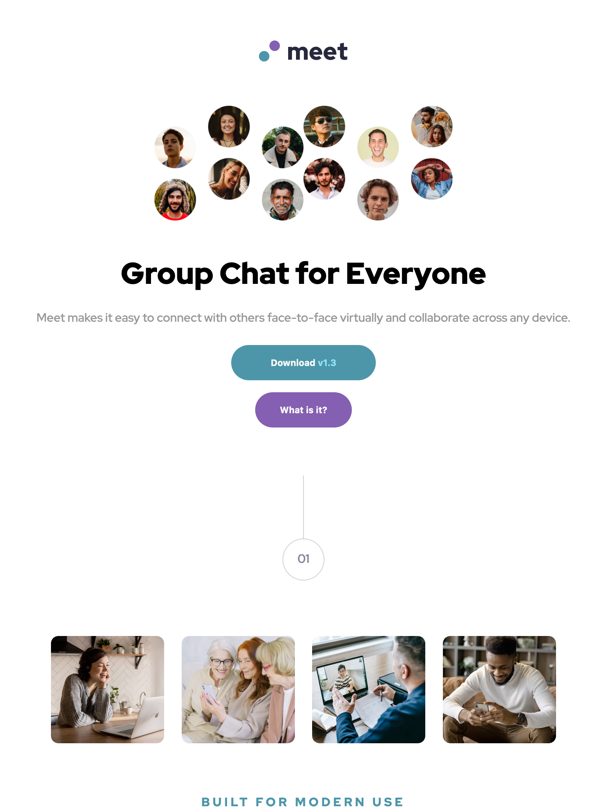
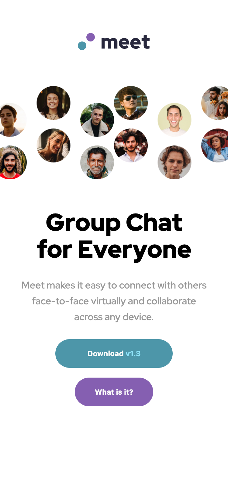

# Frontend Mentor - Meet landing page solution

This is my solution to the [Meet landing page challenge on Frontend Mentor](https://www.frontendmentor.io/challenges/meet-landing-page-rbTDS6OUR).

## Table of contents

- [Overview](#overview)
  - [The challenge](#the-challenge)
  - [Screenshot](#screenshot)
  - [Links](#links)
- [My process](#my-process)
  - [Built with](#built-with)
  - [What I learned](#what-i-learned)
  - [Continued development](#continued-development)
  - [Useful resources](#useful-resources)
- [Author](#author)
- [Acknowledgments](#acknowledgments)

**Note: Delete this note and update the table of contents based on what sections you keep.**

## Overview

### The challenge

Users should be able to:

- View the optimal layout depending on their device's screen size
- See hover states for interactive elements

### Screenshot

Desktop


Tablet


Mobile


### Links

- Solution URL: [Github](https://github.com/Mabchir/meet-landing-page-challenge)
- Live Site URL: [Netlify](https://github.com/Mabchir/meet-landing-page-challenge)

## My process

### Built with

- Semantic HTML5 markup
- CSS custom properties
- Flexbox
- JQuery

### What I learned

How to add a virtual line

```html
<style>
  .vl {
    border-left: 6px solid green;
    height: 500px;
  }
</style>

<div class="vl"></div>
```

how to add a color to a background image using box-shadow

```css
html {
  min-height: 100%;
  background: url(http://lorempixel.com/800/600/nature/2);
  background-size: cover;
  box-shadow: inset 0 0 0 2000px rgba(255, 0, 150, 0.3);
}
```

move elements according to window size

```js
$(window).resize(function () {
  if ($(window).width() < 768) {
    $("#moveElement").appendTo(".b");
  } else {
    $("#moveElement").appendTo(".a");
  }
});
```

### Continued development

Biggest Challenge: Responsiveness from small screen to big screen.

- I built the website using the phone design first
- but the Desktop version requires that an element (firstpart) movers inbetween the two images (bubbleImg).
- That requires JQuery, which I successfully did (but it still looks weird and redundant)
- However when deployed on netlify the jquery code doesn't seem to be executed at all...

What to do ? !

### Useful resources

- [w3schools](https://www.w3schools.com/howto/howto_css_vertical_line.asp) - How to add a virtual line .
- [stackoverflow](https://stackoverflow.com/questions/38145368/css-workaround-to-backdrop-filter) - the backdrop-filter and how it's not supported by all browsers
- [stackoverflow](https://stackoverflow.com/questions/36679649/how-to-add-a-color-overlay-to-a-background-image) - how to add a color overlay to a background image using box-shadow
- [cssTricks](https://css-tricks.com/how-to-stack-elements-in-css/) - how to stack different children elements
- [theprogrammingexpert](https://theprogrammingexpert.com/jquery-move-element-after-another/) - use jguery to move elements after another
- [coderWall](https://coderwall.com/p/_jothq/jquery-when-to-use-document-ready-and-when-window-load) - $(document).ready vs $(window).load
- [stackoverflow](https://stackoverflow.com/questions/43229447/how-to-move-div-inside-another-in-on-responsive) - how to move elements depending on screen size
- [nekocalc](https://nekocalc.com/px-to-rem-converter)- convert px to rem

## Author

- Website - [Mariem Bchir](https://goofy-easley-2c8717.netlify.app/index.html)

- Frontend Mentor - [@Mabchir](https://www.frontendmentor.io/profile/Mabchir)

- Github - [Mabchir](https://github.com/Mabchir)

**Note: Delete this note and add/remove/edit lines above based on what links you'd like to share.**

## Acknowledgments

Shoutout to the following member of Frontend Mentors whose feedback on my previous challenge was very helpful in making this challenge a success :

- Frontend Mentor - [@TheCoderGuru](https://www.frontendmentor.io/profile/grace-snow)
